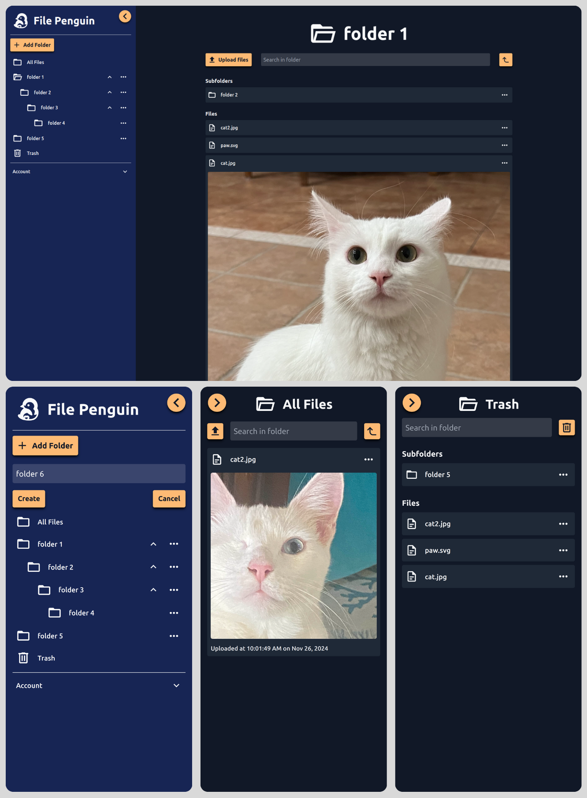

<a id="readme-top"></a>

<!-- PROJECT LOGO -->
<br />
<div align="center">
  <a href="https://github.com/Ben-Long50/file-penguin-frontend.git">
    
  </a>

<h1 align="center">File Penguin</h1>

  <p align="center">
    A fullstack file storage system application
    <br />
    <a href="https://github.com/Ben-Long50/file-penguin-frontend.git"><strong>Explore the docs »</strong></a>
    <br />
    <br />
    <a href="https://file-penguin.netlify.app/">View Demo</a>
    ·
    <a href="https://github.com/Ben-Long50/file-penguin-frontend/issues/new?labels=bug&template=bug-report---.md">Report Bug</a>
    ·
    <a href="https://github.com/Ben-Long50/file-penguin-frontend/issues/new?labels=enhancement&template=feature-request---.md">Request Feature</a>
  </p>
</div>

<!-- TABLE OF CONTENTS -->
<details>
  <summary>Table of Contents</summary>
  <ol>
    <li>
      <a href="#about-the-project">About The Project</a>
      <ul>
        <li><a href="#built-with">Built With</a></li>
        <li><a href="#features">Features</a></li>
      </ul>
    </li>
    <li>
      <a href="#getting-started">Getting Started</a>
      <ul>
        <li><a href="#prerequisites">Prerequisites</a></li>
        <li><a href="#installation">Installation</a></li>
      </ul>
    </li>
    <li><a href="#contact">Contact</a></li>
  </ol>
</details>

<!-- ABOUT THE PROJECT -->

## About The Project

<a href="https://file-penguin.netlify.app/">
  
</a>

<p align="right">(<a href="#readme-top">back to top</a>)</p>

### Built With

<a href="https://reactjs.org">
  
</a>

<a href="https://vitejs.dev">
  
</a>

<a href="https://react-query.tanstack.com">
  
</a>

<a href="https://reactrouter.com">
  
</a>

<a href="https://tailwindcss.com">
  
</a>

<p align="right">(<a href="#readme-top">back to top</a>)</p>

<!-- FEATURES -->

### Features

- JWT based local authentication
- Reoganize folders and files using a drag and drop system
- Upload up to 5 files at once
- Preview files in the browser before downloading them
- Delete the entire trash folder contents or select folders and files individually to delete
- Fully responsive design which looks great on any screensize, mobile and desktop
- Light and dark theme support
<p align="right">(<a href="#readme-top">back to top</a>)</p>

<!-- GETTING STARTED -->

## Getting Started

To access the live version of this project and explore all of it's features, use the official website link below. Otherwise, continue with the following instructions to run the project locally

<a href="https://file-penguin.netlify.app/">
  <strong>File Penguin »</strong>
</a>

### Prerequisites

1. You will first need to clone the backend API repo and run it. Please take a look at the instructions regarding the backend API in the following link:

   <a href="https://github.com/Ben-Long50/file-penguin-backend.git"><strong>File Penguin API repo »</strong></a>

### Installation

1. **Clone the Repository**  
   Run the following command to clone the repository:
   ```sh
   git clone https://github.com/Ben-Long50/file-penguin-frontend.git
   ```
2. **Navigate to the Project Directory and Install Dependencies**  
   Move into the project directory and install the required npm packages:
   ```sh
   cd file-penguin-frontend
   npm install
   ```
3. **Set Up Environment Variables**  
   Create a .env file in the project’s base directory and add the following environment variable:
   ```js
   VITE_API_URL = 'http://localhost:3000';
   ```
4. **Avoid Accidental Pushes to the Original Repository**  
   If you plan to make changes, update the Git remote to point to your own fork to prevent accidental pushes to the base repository:

   ```sh
   git remote set-url origin https://github.com/<your_github_username>/file-penguin-frontend.git
   ```

   Confirm the change:

   ```sh
   git remote -v
   ```

   You should see:

   ```sh
   origin  https://github.com/<your_github_username>/file-penguin-frontend.git (fetch)
   origin  https://github.com/<your_github_username>/file-penguin-frontend.git (push)
   ```

5. **Start the Development Server**  
   Run the following command to start the app:
   ```sh
   npm run dev
   ```

<p align="right">(<a href="#readme-top">back to top</a>)</p>

<!-- CONTACT -->

## Contact

Ben Long - [LinkedIn](https://www.linkedin.com/in/ben-long-4ba566129/)

Email - benjlong50@gmail.com

Project Link - [https://github.com/Ben-Long50/file-penguin-frontend](https://github.com/Ben-Long50/file-penguin-frontend)

<p align="right">(<a href="#readme-top">back to top</a>)</p>

<!-- MARKDOWN LINKS & IMAGES -->
<!-- https://www.markdownguide.org/basic-syntax/#reference-style-links -->
